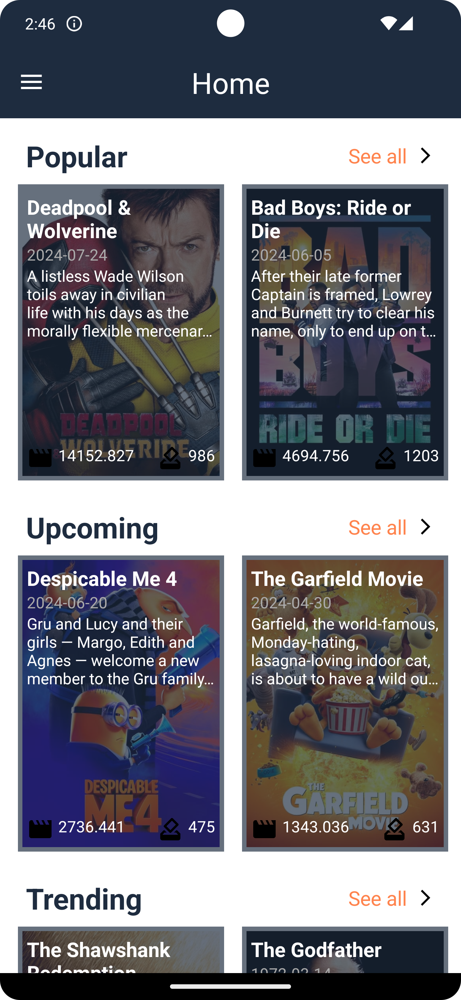

# 🎞️ Muuvi 

## Table of Contents

* [About](#about)
* [Features](#features)
* [Screenshots](#screenshots)
* [Security](#security)

## About

Muuvi is a personalised movie history browsing application. Thanks to Muuvi, you can keep track of the movies you have watched, add them to favourites and share them with your friends.

## Features

- **[Clean Architecture]()**: Separation of concerns with clearly defined layers.
- **[MVVM]()**: For better testability and maintainability.
- **[Dependency Injection]()**: Using Hilt to manage dependencies.
- **[Asynchronous Programming]()**: Using Kotlin Coroutines.
- **[Network Requests]()**: Managed with Retrofit.
- **[API Key Management]()**: Secrets are kept secure using the secrets-gradle-plugin.
- **[LiveData]()**: LiveData is used to observe changes in data and update the UI.
- **[Image Loading]()**: Using Glide for efficient image loading and caching.
- **[ViewBinding]()**:Replacing findViewById to access xml layout elements.
- **[DiffUtil]()**: Calculating difference between new list and old list efficiently.

## Screenshots

| splash | login | home |
|:-:|:-:|:-:|
|  |  |  |
| drawer | search | movie detail |
|  |  |  

## 🔒 Security
- Secrets are kept secure using the secrets-gradle-plugin.